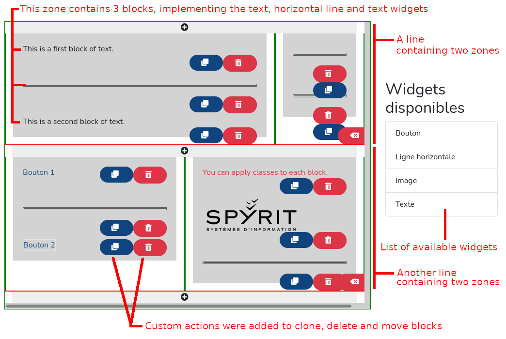

SpyritPageBuilderBundle
=======================

# About

A page builder to integrate in a Symfony/Doctrine/Twig project.

**Notice**: this bundle is highly experimental, there may be important changes without warning.

## Basic principles

A *page* is a set of *lines* which contain *zones* (think about the Bootstrap grid with *rows* and *divs* that cover columns).

Each zone can contain one or several *blocks*. A block is an instantiation of a *widget*. Widgets are a set of configurable elements.

A few widgets (button, image, horizontal line, text) are provided but you will need to implement your own based on the purpose of your application (custom videos, articles, etc.).



# Installation

Require the bundle with composer:

    composer require spyrit/page-builder-bundle

# Storage

Ideally, we would like this bundle to be storage-agnostic.

For now, it has only been used with Doctrine, so you are encouraged to set up database, and the following entities Block, Page, Zone.

You can name those entities as you like. You can create specific entities or reuse ones from your project. You **can** make them use `BlockTrait`, `PageTrait` and `ZoneTrait` but you don't have to. But your entities **must** extend `BlockInterface`, `PageInterface`, `ZoneInterface`.

```
<?php

namespace App\Entity;

use App\Repository\BlocRepository;
use Doctrine\ORM\Mapping as ORM;
use Spyrit\Bundle\SpyritPageBuilderBundle\Model\BlockInterface;
use Spyrit\Bundle\SpyritPageBuilderBundle\Model\BlockTrait;

/**
 * @ORM\Entity(repositoryClass=BlockRepository::class)
 */
class Block implements BlockInterface
{
    use BlockTrait;

    /**
     * @ORM\Id
     * @ORM\GeneratedValue
     * @ORM\Column(type="integer")
     */
    private $id;

    public function getId(): ?int
    {
        return $this->id;
    }
}
```

You will have to implement the `getConfiguration`, `setConfiguration` and `getWidget` methods in your class to match your storage.

If you add custom widgets, you will also need to implement `setWidget`.

```
<?php

namespace App\Entity;

use App\Repository\PageRepository;
use Doctrine\ORM\Mapping as ORM;
use Spyrit\Bundle\SpyritPageBuilderBundle\Model\PageInterface;
use Spyrit\Bundle\SpyritPageBuilderBundle\Model\PageTrait;

/**
 * @ORM\Entity(repositoryClass=PageRepository::class)
 */
class Page implements PageInterface
{
    use PageTrait;

    /**
     * @ORM\Id
     * @ORM\GeneratedValue
     * @ORM\Column(type="integer")
     */
    private $id;

    public function getId(): ?int
    {
        return $this->id;
    }
}
```

```
<?php

namespace App\Entity;

use App\Repository\ZoneRepository;
use Doctrine\ORM\Mapping as ORM;
use Spyrit\Bundle\SpyritPageBuilderBundle\Model\ZoneInterface;
use Spyrit\Bundle\SpyritPageBuilderBundle\Model\ZoneTrait;

/**
 * @ORM\Entity(repositoryClass=ZoneRepository::class)
 */
class Zone implements ZoneInterface
{
    use ZoneTrait;

    /**
     * @ORM\Id
     * @ORM\GeneratedValue
     * @ORM\Column(type="integer")
     */
    private $id;

    public function getId(): ?int
    {
        return $this->id;
    }
}
```

# How to use

## Add a widget

* Create a class that heritates from BaseWidget.
* Create Twig templates for your widget (one editor template and one front template if needed)
* Create your widget's form

## Render (read only)

* To display a build page (e.g. on a public route), you will need to call the `renderPage` method from the `RenderManager` service.

```
use Spyrit\Bundle\SpyritPageBuilderBundle\Manager\RenderManager;

public function show(Page $page, RenderManager $renderManager): Response
{
    return $this->render('render.html.twig', [
        'html' => $renderManager->renderPage($page),
    ]);
}
```

Where `render.html.twig` can mimic `@SpyritPageBuilder/render/base.html.twig`.

## Render (editor)

* To render the page builder (e.g. on a private route, for admins), you will need to call the `renderPage` method from the `RenderManager` service, with the second argument as `true`.

```
use Spyrit\Bundle\SpyritPageBuilderBundle\Manager\RenderManager;
use Spyrit\Bundle\SpyritPageBuilderBundle\Widget\Widget;

public function edit(Page $page, RenderManager $renderManager): Response
    return $this->render('editor.html.twig', [
        'html' => $renderManager->renderPage($page, true),
        'widgets' => Widget::CHOICES, // or plug here your custom list of Widgets
    ]);
}
```

Where `editor.html.twig` can mimic `@SpyritPageBuilder/editor/editor.html.twig`.

## Styling the editor

You are encouraged to write your own CSS, but you can also use the provided `page-builder.scss`. To use it, add this to your `webpack.config.js`:

    .addStyleEntry('css/page-builder', './vendor/spyrit/page-builder-bundle/src/Resources/public/css/page-builder.scss')

And in your editor page:

```



    {{ encore_entry_link_tags('css/page-builder') }}



    <div class="page-editor">
        
    </div>



    {{ include('@SpyritPageBuilder/editor/editor_js.html.twig') }}

```
